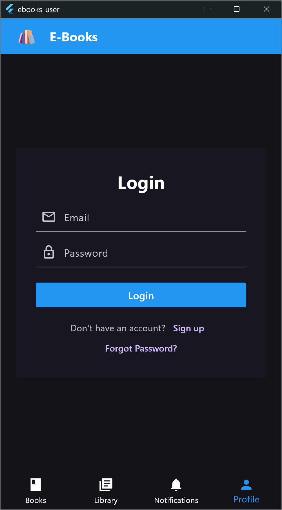
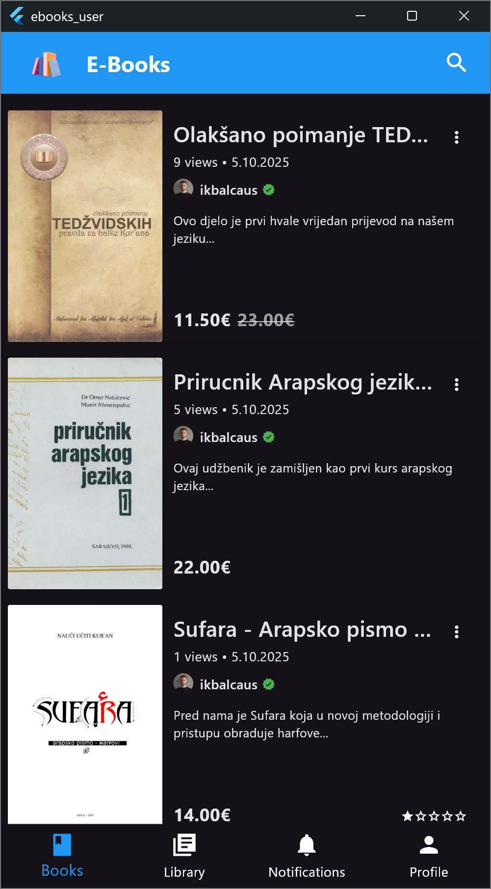
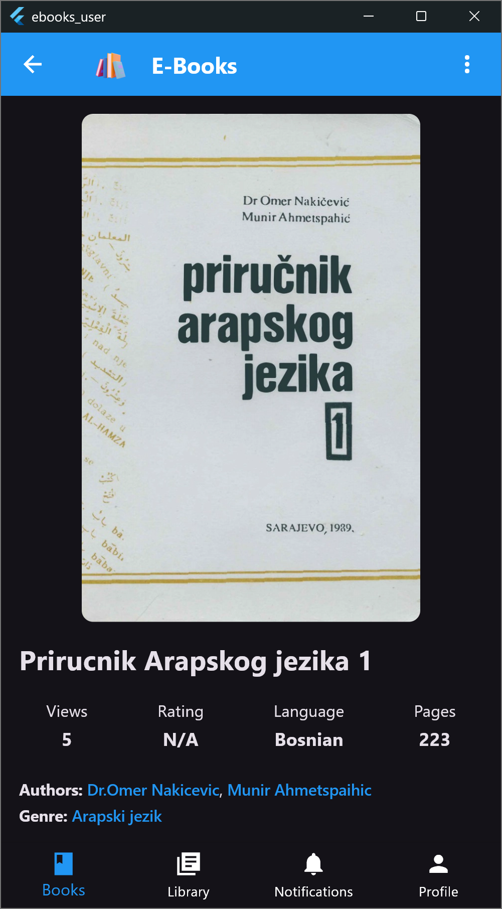
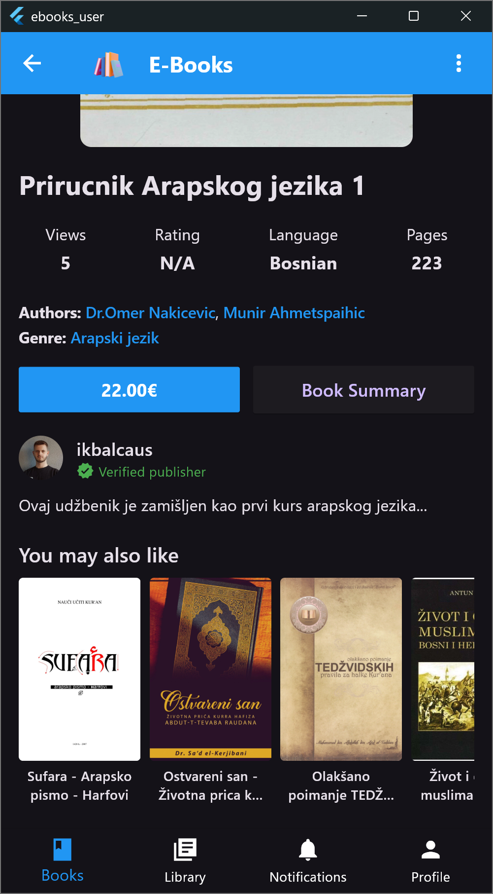

# E-Books - Digital Book Publishing & Reading Platform

**E-Books** is a complete digital publishing ecosystem that allows users
to publish, read, and purchase books.  
The platform consists of:

-   **Backend API** built with C# .NET  
-   **Admin panel** built with Flutter (Windows)  
-   **User mobile app** built with Flutter (Android/iOS)

## Project Structure

    /server       → .NET Web API
    /client
        /admin    → Flutter admin desktop app (Windows)
        /user     → Flutter user mobile app (Android/iOS)

## Running the Backend

### 1. Set Secret Keys Using .NET User Secrets

``` bash
cd server
dotnet user-secrets set "Stripe:SecretKey" "{YOUR_SECRET_KEY}"
dotnet user-secrets set "Stripe:PublishableKey" "{YOUR_PUBLISHABLE_KEY}"
dotnet user-secrets set "Stripe:WebhookSecret" "{YOUR_WEBHOOK_SECRET}"
dotnet user-secrets set "AppSettings:ngrokURL" "{YOUR_NGROK_URL}"
dotnet user-secrets set "EmailSettings:SmtpServer" "{SMTP_SERVER}"
dotnet user-secrets set "EmailSettings:Port" "{PORT}"
dotnet user-secrets set "EmailSettings:SenderName" "{SENDER_NAME}"
dotnet user-secrets set "EmailSettings:SenderEmail" "{SENDER_EMAIL}"
dotnet user-secrets set "EmailSettings:Password" "{EMAIL_PASSWORD}"
```

### 2. Run the API

``` bash
cd server
dotnet restore
dotnet build
dotnet run
```

API will run at:
``` bash
https://localhost:7210
```

## Running the User App

``` bash
cd client/user
flutter pub get
flutter run
```


## Running the Admin Panel

``` bash
cd client/admin
flutter pub get
flutter run -d windows
```

## Application Preview





